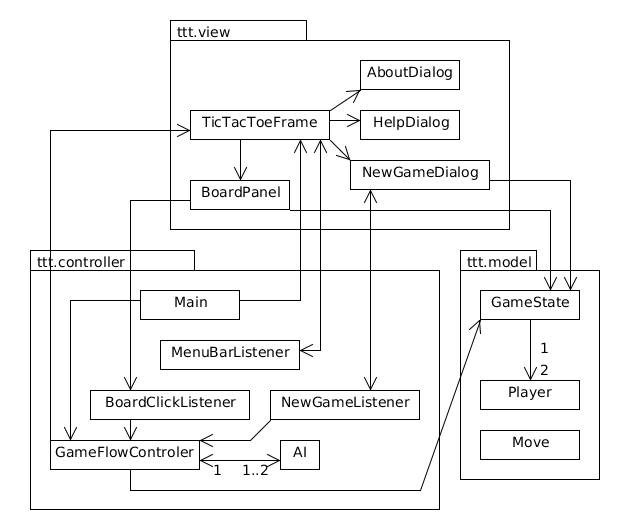
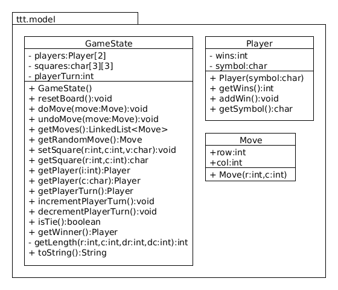
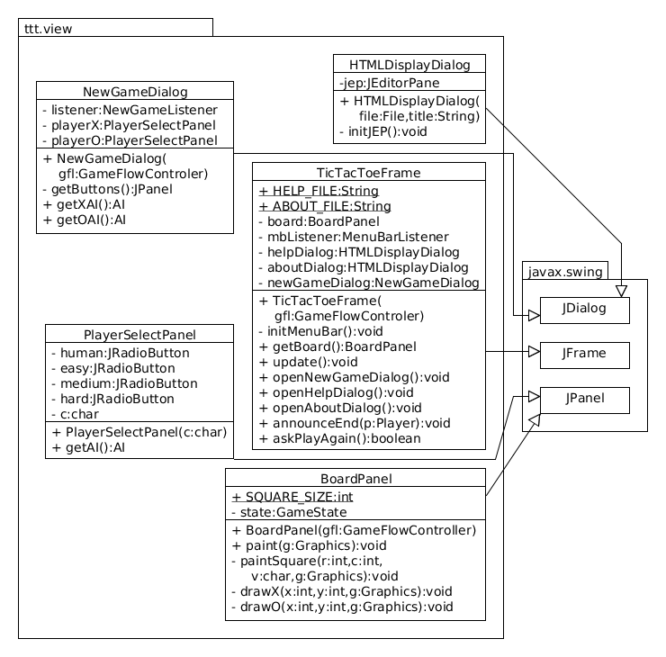
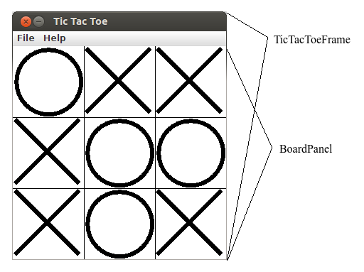
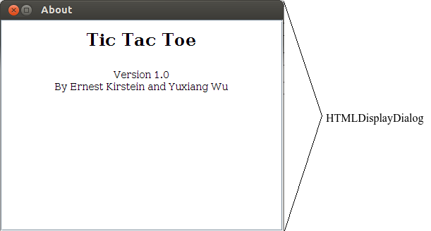
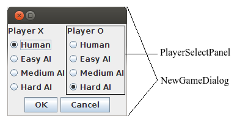
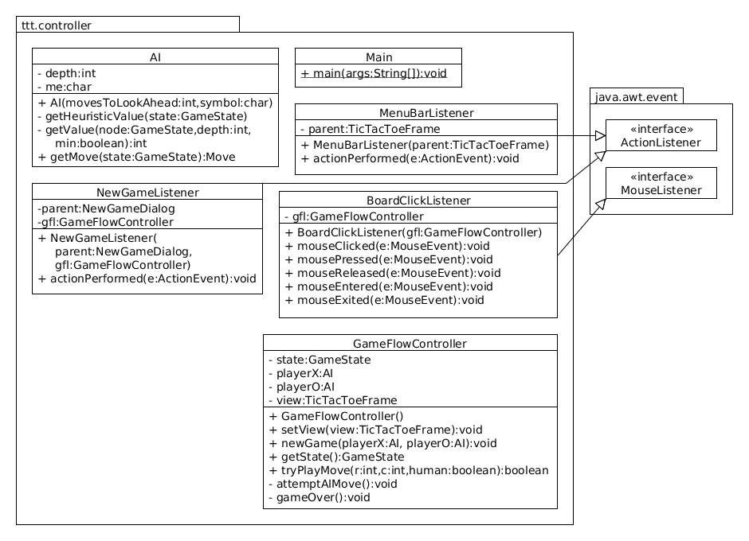

<h1>
 Software Design Description (SDD) 
 Tic-Tac-Toe Game 
</h1>
 Date: May 14th, 2013 
 Ernest Kirstein 
 Yuxiang Guo 

	

	

<h1 class="c5">Table Of Contents</h1>

	<a class="c3" href="#h.9jri1dprog68">Table Of Contents</a>

	<a class="c3" href="#h.7jb7y24pyeoi">1 - Scope (Yuxiang)</a>

	<a class="c3" href="#h.kb8c6fe18052">1.1 - Identification (Yuxiang)</a>

	<a class="c3" href="#h.41c942h0vnxy">1.2 - System Overview (Yuxiang)</a>

	<a class="c3" href="#h.o1sfg6tjghgu">1.3 - Document Overview (Yuxiang)</a>

	<a class="c3" href="#h.pm3cmp4oxt7y">2 - Reference Documents (All)</a>

	<a class="c3" href="#h.6j2vhxt3l8zb">3 - System Wide Design Decisions (Yuxiang)</a>

	<a class="c3" href="#h.wtbwsafph973">4 - System Architecture Design (Ernest)</a>

	<a class="c3" href="#h.xmtljrd63mq6">4.1 - ttt.model Package Design</a>

	<a class="c3" href="#h.x120fcm3jlt3">4.1.1 - GameState (Ernest)</a>

	<a class="c3" href="#h.oygz7nwlwl8v">4.1.2 - Player (Yuxiang)</a>

	<a class="c3" href="#h.v5jyfnqu6zsn">4.1.3 - Move (Yuxiang)</a>

	<a class="c3" href="#h.smskl0txwm6w">4.2 - ttt.view Package Design</a>

	<a class="c3" href="#h.boo4oqi8j2gy">4.2.1 - TicTacToeFrame (Ernest)</a>

	<a class="c3" href="#h.969s09cl99um">4.2.2 - BoardPanel (Ernest)</a>

	<a class="c3" href="#h.58qs6qtvvxxu">4.2.3 - HTMLDisplayDialog (Ernest)</a>

	<a class="c3" href="#h.chvm8pva1zl2">4.2.4 - NewGameDialog (Ernest)</a>

	<a class="c3" href="#h.ho4o1onukdwx">4.2.5 - PlayerSelectPanel (Ernest)</a>

	<a class="c3" href="#h.mgvxyq3kz6vo">4.3 - ttt.controller Package Design</a>

	<a class="c3" href="#h.d668avog6new">4.3.1 - Main (Yuxiang)</a>

	<a class="c3" href="#h.7h8gstdr3fzt">4.3.2 - GameFlowController (Ernest)</a>

	<a class="c3" href="#h.ng5mkyb2pw5p">4.3.3 - AI (Ernest)</a>

	<a class="c3" href="#h.mp227gdstnq">4.3.4 - NewGameListener (Ernest)</a>

	<a class="c3" href="#h.rgnvh0o8inro">4.3.5 - MenuBarListener (Ernest)</a>

	<a class="c3" href="#h.dxaup43fuq09">4.3.6 - BoardClickListener (Ernest)</a>

	<a class="c3" href="#h.s12ha3ou3lx2">4.4 - Concept of Execution (Yuxiang)</a>

	<a class="c3" href="#h.va8w658hu8j4">5 - Fundamental Models (Yuxiang)</a>

	<a class="c3" href="#h.mov2xip2jlcd">5.1 - Failure Model (Yuxiang)</a>

	<a class="c3" href="#h.3t61slqkbxqx">6 - Glossary (Yuxiang)</a>

	<a class="c3" href="#h.v96clys5myg8">7 - Notes (All)</a>

	

	

	

<h1 class="c5">1 - Scope (Yuxiang)</h1>
<h2 class="c5">1.1 - Identification (Yuxiang)</h2>

	&nbsp;&nbsp;&nbsp;&nbsp;&nbsp;&nbsp;&nbsp;&nbsp;This document is the first version of Software Design Description (SDD, for short) for the Tic-Tac-Toe Game, and it&nbsp;provides the description of Tic-Tac-Toe Game (ttt, for short) at the application level. The Tic-Tac-Toe Game is a small PC game that can be played by one or two players. This document shows the details of this application and the relationships between the application packages.

<h2 class="c5">1.2 - System Overview (Yuxiang)</h2>

	&nbsp;&nbsp;&nbsp;&nbsp;&nbsp;&nbsp;&nbsp;&nbsp;The Tic-Tac-Toe Game is a PC application that can be played by one or two players. It shall use a Model-View-Controller architecture. The Model-View-Controller architecture shall contains three application packages: &nbsp;view, controller and model; and the three application packages shall be connected to each other. Through the three application packages, the player shall select the types of game (PVE or PVP), start a new game, and play the game on a board panel. At the same time, the application shall record the player&rsquo;s information, handel all actions and provide varying levels of artificial intelligence PVE. 

<h2 class="c5">1.3 - Document Overview (Yuxiang)</h2>

	&nbsp;&nbsp;&nbsp;&nbsp;&nbsp;&nbsp;&nbsp;&nbsp;Section 1: provides the identification information of document and the system overview.

	Section 2: identifies the documents that are referenced within this document.

	Section 3: provides the design decisions that shall be applied to the Tic-Tac-Toe Game across the entire project.

	Section 4: provides architecture design of the application and internal interfaces among the three application packages.

	Section 5: provides the fundamental models of the solutions that explain and justify the design decisions.

<h1 class="c5">2 - Reference Documents (All)</h1>
<ol class="c15" start="1">
	<li class="c2 c7 c14">Wikipedia - For help developing the artificial intelligence. 
	<a class="c3" href="http://en.wikipedia.org/wiki/Minimax">http://en.wikipedia.org/wiki/Minimax</a></li>
	<li class="c2 c14 c7"><a class="c3" href="http://bluehawk.monmouth.edu/~btepfenh/Courses/SE505/Sections/applicationdesign.html">http://bluehawk.monmouth.edu/~btepfenh/Courses/SE505/Sections/applicationdesign.html</a>&nbsp;- For designing the Tic-Tac-Toe Game at the application level.</li>
	<li class="c2 c14 c7"><a class="c3" href="http://docs.oracle.com/javase/tutorial/">http://docs.oracle.com/javase/tutorial/</a>&nbsp;- For Java Programming.</li>
</ol>
<h1 class="c5">3 - System Wide Design Decisions (Yuxiang)</h1>

	&nbsp;&nbsp;&nbsp;&nbsp;&nbsp;&nbsp;&nbsp;&nbsp;In this design, there are several design decisions that apply across the entire project. They are listed as following:

	

	&nbsp;&nbsp;&nbsp;&nbsp;&nbsp;&nbsp;&nbsp;&nbsp;1. The Tic-Tac-Toe Game will be supported by the following operating systems of PC:

	Windows XP/Vista/7/8

	Linux Kernel version 2.4 and higher

	Mac OS X 10.4 (Tiger)

	2. All user interfaces shall be easy and clear to guide the customers to operate them and get the related information.

	3. All contents of the Tic-Tac-Toe Game shall follow the local laws.

	4. The Tic-Tac-Toe Game shall support up to 2 players to use at the same time.

	5. The Tic-Tac-Toe Game shall respond quickly when the player operates them.

	

	These design decisions shall be propagated to all components for which the decision is relevant.

	

	

<h1 class="c5">4 - System Architecture Design (Ernest)</h1>

	

	Figure 4.1 (Ernest)

	This system will use a Model-View-Controller architecture. The Model for this TicTacToe game includes a mutable GameState which has two Player&rsquo;s. The Model also contains a simple Move class for storing row-column pairs. The View for this system has&nbsp;a main TicTacToeFrame which contains the other instantiated objects of this package. The BoardPanel displays the GameState for the TicTacToe game. The three dialogs will display information about the system and menus for starting a new game. The Controller contains the Main class as well as the GameFlowController which controls the flow of this turn based game. The Controller also contains the three event listeners which will handle all actions and mouse events which occur in the View. Finally, the Controller contains an AI class which provides varying levels of artificial intelligence for a human player to play against.
	

<h2 class="c5">4.1 - ttt.model Package Design</h2>

	 
	Figure 4.1.1 (Ernest)

	&nbsp;&nbsp;&nbsp;&nbsp;&nbsp;&nbsp;&nbsp;&nbsp;This package contains the Model part of the model-view-controller architecture. The sections below describe the individual classes of this package more completely.

<h3 class="c5">4.1.1 - GameState (Ernest)</h3>

	&nbsp;&nbsp;&nbsp;&nbsp;&nbsp;&nbsp;&nbsp;&nbsp;The GameState class contains all the information about the current state of a Tic Tac Toe game. The squares&nbsp;array contains a character value for each square in the Tic Tac Toe board. An empty square is represented by a space character. The player&nbsp;array contains the Players, who each have their own specified symbol which is used to fill the squares&nbsp;array. The playerTurn&nbsp;integer is an index which corresponds to the player in the player&nbsp;array whose turn it is. The constructor creates an empty Tic Tac Toe board, both Players, and initializes the playerTurn&nbsp;index to zero. The reseatBoard&nbsp;method returns the board to an empty state and resets the playerTurn&nbsp;to zero.

	&nbsp;&nbsp;&nbsp;&nbsp;&nbsp;&nbsp;&nbsp;&nbsp;The doMove&nbsp;method and the undoMove&nbsp;method methods perform and perform a move in the Tic Tac Toe game. They also increment and decrement the playerTurn&nbsp;index respectively. These methods expect a valid move but will not throw an error if an invalid move is given. The getMoves&nbsp;method returns a java.util.LinkedList&nbsp;of all the valid moves that are available at the current game state. The getRandomMove&nbsp;method returns a random valid move.

	&nbsp;&nbsp;&nbsp;&nbsp;&nbsp;&nbsp;&nbsp;&nbsp;The getSquare&nbsp;and setSquare&nbsp;method take row-column integer pairs and a value character as parameters. They provide public access to the squares&nbsp;array. The getPlayer&nbsp;methods provide access to the players&nbsp;array by index and by the character symbol of the desired Player. The methods incrementPlayerTurn&nbsp;and decrementPlayerTurn&nbsp;do as their name implies but in the modular domain (once playerTurn&nbsp;goes past a valid index, it loops back to a valid one). 

	The isTie method determines whether or not the game is in a tie. The getWinner&nbsp;method returns the Player who has won the current game or null if there is no winner or the game is tied. The getLength&nbsp;method is used by the getWinner&nbsp;method. It returns the length of same continuous Player symbols (not empty spaces) in the vector direction &lt;dr,dc&gt; from the point (r,c).

	The toString&nbsp;method provides a command-line-printable string which shows the state of the Tic Tac Toe board.

<h3 class="c5">4.1.2 - Player (Yuxiang)</h3>

	&nbsp;&nbsp;&nbsp;&nbsp;&nbsp;&nbsp;&nbsp;&nbsp;The Player&nbsp;class is applied to manage the player&rsquo;s information. The number of wins and symbol of the player should be got by the methods in the Player&nbsp;class. The variables and methods in Player&nbsp;class are described as follows:

	&nbsp;&nbsp;&nbsp;&nbsp;&nbsp;&nbsp;&nbsp;&nbsp;wins: integer variable, represents the number of wins;

	&nbsp;&nbsp;&nbsp;&nbsp;&nbsp;&nbsp;&nbsp;&nbsp;symbol: char variable, represents the symbol that is used in the board by the player;

	&nbsp;&nbsp;&nbsp;&nbsp;&nbsp;&nbsp;&nbsp;&nbsp;Player (symbol: char): constructor, creates a new player, defines the new player&rsquo;s symbol and initializes the number of wins is equal to zero;

	&nbsp;&nbsp;&nbsp;&nbsp;&nbsp;&nbsp;&nbsp;&nbsp;getWins(): obtains the number of wins;

	&nbsp;&nbsp;&nbsp;&nbsp;&nbsp;&nbsp;&nbsp;&nbsp;addWins(): the number of wins is increased 1;

	getSymbol(): obtains the symbol of the player.

<h3 class="c5">4.1.3 - Move (Yuxiang)</h3>

	&nbsp;&nbsp;&nbsp;&nbsp;&nbsp;&nbsp;&nbsp;&nbsp;The Move&nbsp;class is applied to mark the location of the symbol by the row-column method. The variables and methods in Move&nbsp;class are described as follows:

	&nbsp;&nbsp;&nbsp;&nbsp;&nbsp;&nbsp;&nbsp;&nbsp;row: integer variable, represents the row number of the Tic-Tac-Toe board;

	&nbsp;&nbsp;&nbsp;&nbsp;&nbsp;&nbsp;&nbsp;&nbsp;col: integer variable, represents the column number of the Tic-Tac-Toe board;

	&nbsp;&nbsp;&nbsp;&nbsp;&nbsp;&nbsp;&nbsp;&nbsp;Move (r:int, c:int): constructor, according to the two integer parameters r and c, this method sets the location of the symbol on Tic-Tac-Toe board.

<h2 class="c5 c19"></h2>
<h2 class="c5">4.2 - ttt.view Package Design</h2>

	

	Figure 4.2.1 (Ernest)

	&nbsp;&nbsp;&nbsp;&nbsp;&nbsp;&nbsp;&nbsp;&nbsp;This package contains the View part of the model-view-controller architecture. The sections below describe the individual classes of this package more completely.

<h3 class="c5">4.2.1 - TicTacToeFrame (Ernest)</h3>

	The TicTacToeFrame (shown in figure 4.2.2) has a menu bar, the BoardPanel, and can open the three dialogs. The final static String values contain the file locations of the help and about HTML files respectively. This class extends java.swing.JFrame. 

	The constructor instantiates all of the components, their listeners, and the dialogs. It also, resizes, and centers the frame but it does not make it visible yet. The initMenuBar&nbsp;method is called by the constructor to build the menu bar. 

	The getBoard&nbsp;method returns the board&nbsp;variable. The update&nbsp;repaints and performs any necessary update functions to make sure the view represents the current GameState. The openNewGameDialog, openHelpDialog, and openAboutDialog&nbsp;methods open the respective dialogs. The announceEnd&nbsp;announces the end of a game and displays Player p&nbsp;as the winner; if p&nbsp;is null, then this method announces a tie. The askPlayAgain&nbsp;method prompts the user to play again and returns their choice (true for yes).

	

	Figure 4.2.2 (Ernest)

<h3 class="c5">4.2.2 - BoardPanel (Ernest)</h3>

	The BoardPanel (see Figure 4.2.2) displays the squares of the GameState. The SQUARE_SIZE&nbsp;is 100 pixels. The state&nbsp;attribute is a reference to the mutable GameState. The constructor initializes the state&nbsp;attribute and adds a new BoardClickListener to this objects mouse event handler list. This class extends javax.swing.JPanel. 

	The paint&nbsp;method overrides the same method in the superclass; it draws what is shown in figure 4.2.2. The private methods (paintSquare, drawX, drawO) are used by the main paint method to draw the board. 

	

	Figure 4.2.3 (Ernest)

<h3 class="c5">4.2.3 - HTMLDisplayDialog (Ernest)</h3>

	&nbsp;&nbsp;&nbsp;&nbsp;&nbsp;&nbsp;&nbsp;&nbsp;The HTMLDisplayDialog (see Figure 4.2.3) is for displaying simple HTML documents in a stand-alone window. This class is used for the About dialog as well as the Help dialog in this program. Then constructor for the modal HTMLDisplayDialog takes in a file and a title and produces the dialog, but it does not make it visible. The initJEP&nbsp;method initializes the jep&nbsp;instance variable. The HTMLDisplayDialog extends javax.swing.JDialog.

	

	Figure 4.2.4 (Ernest)

<h3 class="c5">4.2.4 - NewGameDialog (Ernest)</h3>

	&nbsp;&nbsp;&nbsp;&nbsp;&nbsp;&nbsp;&nbsp;&nbsp;The NewGameDialog (see Figure 4.2.4) is used to set up a new Tic Tac Toe game. The listener&nbsp;attribute is applied to the buttons at the bottom of the dialog box. The playerX&nbsp;and playerO&nbsp;attributes are the left and right complex panels respectively. The NewGameDialog extends javax.swing.JDialog.

	&nbsp;&nbsp;&nbsp;&nbsp;&nbsp;&nbsp;&nbsp;&nbsp;The constructor initializes all of the components and the listener, but does not make the dialog visible. The getButtons&nbsp;method is used to initialize the buttons panel. The getXAI&nbsp;and getOAI&nbsp;methods call the getAI&nbsp;method for the playerX&nbsp;and playerO&nbsp;attributes respectively; so they return either an AI object (for a computer player) or null (for a human player).

<h3 class="c5">4.2.5 - PlayerSelectPanel (Ernest)</h3>

	The PlayerSelectPanel (see Figure 4.2.4) is used to set up a single player (computer or human) for a new game. It has four javax.swing.JRadioButtons which each correspond to a human player or some level of artificial intellegence. There is also an instance variable c&nbsp;which corresponds to the symbol (X or O) of this player. PlayerSelectPanel extends javax.swing.JPanel. 

	The constructor initializes the radio buttons. The method getAI&nbsp;returns null for human, an AI with a depth of 1 for easy, 3 for medium, and 5 for hard. The hard AI cannot be beaten, only tied. 
	

<h2 class="c5">4.3 - ttt.controller Package Design</h2>

	

	Figure 4.4.1 (Ernest)

	&nbsp;&nbsp;&nbsp;&nbsp;&nbsp;&nbsp;&nbsp;&nbsp;This package contains the Controller part of the model-view-controller architecture. The sections below describe the individual classes of this package more completely.

<h3 class="c5">4.3.1 - Main (Yuxiang)</h3>

	&nbsp;&nbsp;&nbsp;&nbsp;&nbsp;&nbsp;&nbsp;&nbsp;The Main&nbsp;class performs the main function that creates two objects by the GameFlowController&nbsp;class and the TicTacToeFrame&nbsp;class. Through the Main&nbsp;class, all the functions of the Tic-Tac-Toe game should be invoked and performed.

<h3 class="c5">4.3.2 - GameFlowController (Ernest)</h3>

	&nbsp;&nbsp;&nbsp;&nbsp;&nbsp;&nbsp;&nbsp;&nbsp;The GameFlowController is responsible for triggering AI moves, preventing invalid human moves, and initiating end-game procedures after a tie or a win has occured. The state variable contains the game state. The playerX, and playerO, variables contain the AI for the X and O players respectively; if these values are null then those players are humans. The view&nbsp;variable is a reference to the main display frame.

	&nbsp;&nbsp;&nbsp;&nbsp;&nbsp;&nbsp;&nbsp;&nbsp;The constructor initializes the GameState. The setView&nbsp;method must be called externally before the view is made visible. The newGame&nbsp;method resets the game state, notifies the view, and sets the two AI&rsquo;s. It also attempts to make an AI move, in case the X player is not human. The method getState&nbsp;simply returns the state&nbsp;variable.

	&nbsp;&nbsp;&nbsp;&nbsp;&nbsp;&nbsp;&nbsp;&nbsp;The method tryPlayMove&nbsp;handles all attempted moves from either the AI&rsquo;s or the BoardClickListener. This method guards against invalid human moves and triggers AI moves or end game events when they are applicable. The methods attemptAIMove&nbsp;and gameOver&nbsp;are called in those two events and handle potential AI moves and game-over events respectively.

<h3 class="c5">4.3.3 - AI (Ernest)</h3>

	&nbsp;&nbsp;&nbsp;&nbsp;&nbsp;&nbsp;&nbsp;&nbsp;The AI class handles the artificial intelligence for the computer players using the minimax algorithm (see references). The depth&nbsp;variable determines the number of moves ahead to look each turn. The me&nbsp;character is the symbol (X or O) of the player that this AI represents. Then constructor passes its parameters to the two instance variables.

	&nbsp;&nbsp;&nbsp;&nbsp;&nbsp;&nbsp;&nbsp;&nbsp;The method getHeuristicValue&nbsp;analyzes the given GameState based on it&rsquo;s favorability for the player with the character me&nbsp;(with positive values being good and negative values being bad). The method getValue&nbsp;implements the minimax algorithm to determine the favorability of a state by looking ahead recursively for the given depth. Finally, the public getMove&nbsp;method can be called to retrieve the best-guess Move from this artificial player.

<h3 class="c5">4.3.4 - NewGameListener (Ernest)</h3>

	&nbsp;&nbsp;&nbsp;&nbsp;&nbsp;&nbsp;&nbsp;&nbsp;The NewGameListener handles the button click events from the NewGameDialog. It is an implementation of the java.awt.ActionListener interface. In the actionPerformed&nbsp;method, when an&nbsp;&ldquo;OK&rdquo; command is received the method uses the data from it&rsquo;s parent dialog to trigger a new game in the GameFlowController. If any event is received, the method disposes of it&rsquo;s parent.

<h3 class="c5">4.3.5 - MenuBarListener (Ernest)</h3>

	&nbsp;&nbsp;&nbsp;&nbsp;&nbsp;&nbsp;&nbsp;&nbsp;The MenuBarListener handles the menu button click events from the TicTacToeFrame. It is an implementation of the java.awt.ActionListener interface. In the actionPerformed method, when an action command is received (&ldquo;New Game&rdquo;, &ldquo;Help&rdquo;, or &ldquo;About&rdquo;) the method opens the dialog which corresponds to that command via it&rsquo;s parent class. 

<h3 class="c5">4.3.6 - BoardClickListener (Ernest)</h3>

	&nbsp;&nbsp;&nbsp;&nbsp;&nbsp;&nbsp;&nbsp;&nbsp;The BoardClickListener handles the mouse clicks from the BoardPanel. It is an implementation of the java.awt.MouseListener interface. In the mouseReleased&nbsp;method, the MouseEvent&rsquo;s location is converted into a row-column pair, then a move is attempted via the GameFlowController. The other methods from the MouseListener interface are left empty.

<h2 class="c5">4.4 - Concept of Execution (Yuxiang)</h2>

	The board panel of the Tic-Tac-Toe Game contains three options: &ldquo;About&rdquo;, &ldquo;Help&rdquo;, &ldquo;New Game&rdquo;. The player shall view the information of the Tic-Tac-Toe Game by the &ldquo;About&rdquo; option, view the solutions of FAQ by the &ldquo;Help&rdquo; option, and start a new game by &ldquo;New Game&rdquo; option. The basic execution process of this application is listed as follow: 

	

	1. The user shall open the Tic-Tac-Toe Game application on his/her PC.

	&nbsp;&nbsp;&nbsp;&nbsp;&nbsp;&nbsp;&nbsp;&nbsp;2. The application shall display a board panel on the screen of PC.

	&nbsp;&nbsp;&nbsp;&nbsp;&nbsp;&nbsp;&nbsp;&nbsp;3. The user shall select the &ldquo;New Game&rdquo; option.

	4. The application shall pop up a dialog that lets the user to select the symbol and the type of game (Human or AI).

	5. The user shall select the symbol and the type of game, then click on the &ldquo;OK&rdquo; button.

	6. If the user selects the &ldquo;Human&rdquo; type, the application shall enter into the PVP mode, if the user selects the &ldquo;AI&rdquo; type, the application shall enter into the PVE mode. (In the PVP mode, the application shall be played by two players; and in the PVE mode, the application shall be played by one player.)

	7. The application shall display the squares of the game state on the board panel.

	8. The player shall start the game and place his/her symbol in the squares.

	9. The application shall handle all the actions of player or AI, and estimate who wins.

	10. The application shall display the winner or the tie.

	

<h1 class="c5">5 - Fundamental Models (Yuxiang)</h1>

	This section of the document describes the fundamental models of how the solution operates.

<h2 class="c5">5.1 - Failure Model (Yuxiang)</h2>

	&nbsp;&nbsp;&nbsp;&nbsp;&nbsp;&nbsp;&nbsp;&nbsp;Tic-Tac-Toe Game application has two possibilities to fail during it runs. The failure points are described as follow:

	

	&nbsp;&nbsp;&nbsp;&nbsp;&nbsp;&nbsp;&nbsp;&nbsp;Failure 1: The Tic-Tac-Toe Game application shall not run due to the version of PC operation system is too old. If the version of PC operation system is too old, when the player wants to open the application, the screen of PC shall not display the board panel of the application. Actually, the game application shall not be run by the old PC operation system. For running the Tic-Tac-Toe Game application, the operation system of PC shall not be older than Windows XP, Linux Kernel version 2.4, and Mac OS X 10.4.

	

	&nbsp;&nbsp;&nbsp;&nbsp;&nbsp;&nbsp;&nbsp;&nbsp;Failure 2: The Java platform doesn&rsquo;t be installed the javax.swing package, the view part of the Tic-Tac-Toe Game application shall not run well. Maybe the board panel of the application shall not be displayed on the screen of PC. For running this application, the java platform must be installed the javax.swing package.

	

<h1 class="c5">6 - Glossary (Yuxiang)</h1>

	AI - Artificial Intelligence

	PVE - Player vs Enviroment

	PVP - Player vs Player

	PC - Personal Computer

	FAQ - Frequently Asked Question

